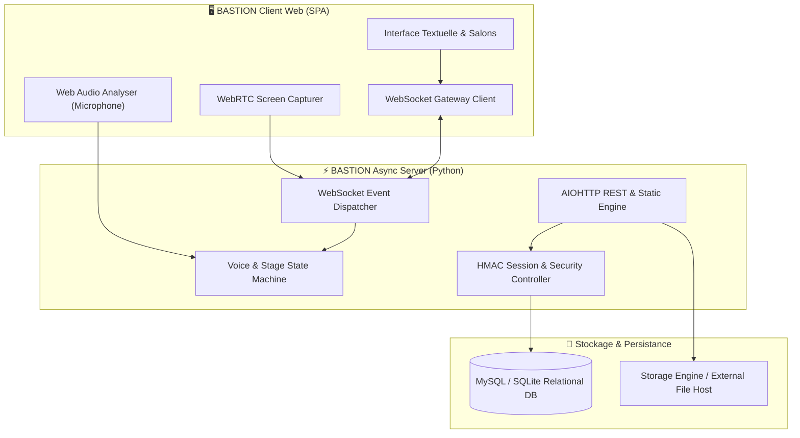

<div align="center">

  

  <p align="center">
    <a href="https://github.com/BASTION"></a>
    <a href="#"></a>
    <a href="#"></a>
    <a href="#"></a>
    <a href="#"></a>
  </p>

  <h3>🏰 La plateforme souveraine, temps réel et ultra-performante pour les communautés modernes.</h3>

  <p align="center">
    <a href="#-à-propos-de-bastion">À propos</a> •
    <a href="#-écosystème--dépôts-bastion">Écosystème & Dépôts</a> •
    <a href="#-fonctionnalités-phares">Fonctionnalités</a> •
    <a href="#-architecture-système">Architecture</a> •
    <a href="#-sécurité--souveraineté">Sécurité</a> •
    <a href="#-démarrage-rapide">Déploiement</a> •
    <a href="#-rejoindre-le-collectif">Rejoindre</a>
  </p>

</div>

---

## 🌟 À Propos de BASTION

**BASTION** est une organisation technologique à but d'innovation logicielle dédiée à la création d'une alternative libre, décentralisable et sans compromis aux plateformes de communication instantanée propriétaires.

Conçu dès le départ pour égaler et surpasser les standards de l'industrie (comme Discord), **BASTION** combine :
- **Fluidité & Réactivité maximale** (latence websocket < 15ms).
- **Fidélité visuelle 100% immersive** (dark mode natif, animations douces, design glassmorphism, responsive).
- **Protection stricte de la vie privée** et souveraineté totale sur vos serveurs, messages et flux multimédias.

```ascii
  ____          _____ _______ _____ ____  _   _ 
 |  _ \   /\   / ____|__   __|_   _/ __ \| \ | |
 | |_) | /  \ | (___    | |    | || |  | |  \| |
 |  _ < / /\ \ \___ \   | |    | || |  | | . ` |
 | |_) / ____ \____) |  | |   _| || |__| | |\  |
 |____/_/    \_\_____/   |_|  |_____\____/|_| \_|
       REAL-TIME COMMUNITY ENGINE & PLATFORM      
```

---

## 🚀 Écosystème & Dépôts BASTION

<div align="center">
  <table>
    <thead>
      <tr>
        <th width="28%">Dépôt / Module</th>
        <th width="47%">Description & Responsabilités</th>
        <th width="25%">Technologies & Statut</th>
      </tr>
    </thead>
    <tbody>
      <tr>
        <td><strong>🏰 <a href="./DiscordApp">bastion-core</a></strong></td>
        <td>Cœur applicatif complet de BASTION : Serveur AIOHTTP asynchrone, passerelle WebSocket, moteur de sessions, base de données et SPA complète.</td>
        <td> <br/><code>Python 3.10+</code> <code>MySQL</code> <code>WebSocket</code></td>
      </tr>
      <tr>
        <td><strong>🎙️ <a href="#">bastion-voice-engine</a></strong></td>
        <td>Moteur de traitement vocal et WebRTC : Analyse de fréquence micro (*Web Audio API*), détection dynamique de parole, mélangeur et passerelle conférence Stage.</td>
        <td> <br/><code>WebRTC</code> <code>Web Audio API</code></td>
      </tr>
      <tr>
        <td><strong>🖥️ <a href="#">bastion-screenshare</a></strong></td>
        <td>Pipeline de capture vidéo et de partage d'écran HD jusqu'à 60 FPS avec gestion multi-flux et streaming fenêtré.</td>
        <td> <br/><code>MediaStream</code> <code>Canvas</code></td>
      </tr>
      <tr>
        <td><strong>🛡️ <a href="#">bastion-badges-sdk</a></strong></td>
        <td>Moteur de badges vectoriels SVG dynamiques et système d'authentification des statuts vérifiés (Fondateur, Partenaire, Officiel, Bot Certifié, Supporter).</td>
        <td> <br/><code>SVG Engine</code> <code>Security API</code></td>
      </tr>
      <tr>
        <td><strong>🤖 <a href="#">bastion-bot-framework</a></strong></td>
        <td>SDK officiel pour développer et connecter des bots interactifs, webhooks et automatisations sur les serveurs BASTION.</td>
        <td> <br/><code>REST API</code> <code>Gateway WS</code></td>
      </tr>
    </tbody>
  </table>
</div>

---

## 💎 Fonctionnalités Phares

### 🎙️ Salons de Conférence (*Stage Channels*)
- **Salle d'attente interactive (*Waiting Screen*)** :
  - Identique à l'expérience Discord avec cartes de raccourci : *Commencer la conférence*, *Créer un événement*, *Continuer sans commencer*.
  - Compteur et liste en temps réel des auditeurs en attente (*ex: `Hugøf attend.`*).
- **Direct de Conférence HD** :
  - **Cartes des Intervenants (*Speakers*)** : Arrière-plan aux couleurs de bannière personnalisée, avatar 76px avec halo vert actif (`#23a55a`), bouclier de modérateur blanc 🛡️ et pastille de pseudo.
  - **Gestion du Public (*Audience*)** : Système de **levée de main ✋** avec notification visuelle immédiate pour les modérateurs et invitation en 1 clic sur scène.
  - **Rôles Hôte / Modérateur** : Possibilité d'expulser vers le public, couper les micros ou clore la conférence.

### 🔊 Salons Vocaux & Détection de Parole en Temps Réel
- **Web Audio API Frequency Analyser** : Analyse acoustique instantanée côté client sans surcharger la bande passante.
- Cerclage lumineux vert `#23a55a` automatique sur l'avatar du locuteur (dans le salon et dans la barre latérale).
- Barre de statut permanente au-dessus du profil : *Vocal connecté* / *Conférence connectée* avec bouton de déconnexion rapide.
- **Soundboard BASTION** : Générateur d'effets sonores Discord (Quack, Airhorn, Ta-da, GG, etc.) synthétisés en temps réel.

### 🖥️ Partage d'écran en Direct (*Live Screen Sharing*)
- Capture plein écran, fenêtre d'application ou onglet navigateur en un clic via `getDisplayMedia`.
- Lecteur vidéo HD sombre avec badge clignotant **`🔴 EN DIRECT`**, nom du diffuseur et mode plein écran.

### 📁 Gestionnaire Multimédia & Pièces Jointes
- Envoi et prévisualisation directe :
  - **Images** (PNG, JPG, GIF, WebP).
  - **Vidéos & Clips** jusqu'à **100 Mo** (MP4, WebM).
  - **Documents** jusqu'à **30 Mo** (PDF, ZIP, TXT, etc.).
- Cycle de vie intelligent : Conservation permanente des avatars et bannières, et purge programmable des pièces jointes éphémères.

---

## 🛠️ Architecture Système



---

## 🧰 Stack Technologique

<div align="center">
  
</div>

- **Backend** : Python 3.10+, AIOHTTP (Asynchrone haute concurrence), WebSocket Gateway.
- **Frontend** : Vanilla HTML5, Modern CSS Variables & Animations, Pure JavaScript ES6+ (zéro framework lourd, performances natives).
- **Audio & Vidéo** : WebRTC MediaStreams, Web Audio API AudioContext & AnalyserNode.
- **Base de données** : MySQL 8.0 / MariaDB avec fallback SQLite automatique.

---

## 🔒 Sécurité & Souveraineté

BASTION applique des standards de sécurité de niveau entreprise :

1. **Hachage cryptographique** : Mots de passe sécurisés avec algorithmes `PBKDF2-SHA256` / `Bcrypt` avec sel aléatoire unique.
2. **Contrôle d'accès basé sur les rôles (RBAC)** : Permissions hiérarchiques vérifiées côté serveur avant chaque modification ou suppression.
3. **Protection contre les injections & failles web** : Requêtes SQL préparées systématiques, assainissement strict des entrées contre le XSS et validation MIME des fichiers téléversés.
4. **Authentification des badges** : Les privilèges et distinctions (Staff, Fondateur, Modérateur) sont certifiés par le serveur et inviolables côté client.

---

## ⚡ Démarrage Rapide

### 1. Prérequis
- **Python 3.10 ou supérieur**
- **MySQL 8.0+** (ou SQLite intégré)
- Navigateur récent compatible WebRTC (Chrome, Firefox, Edge, Safari, Brave)

### 2. Installation

```bash
# Cloner le dépôt de l'organisation
git clone https://github.com/BASTION/bastion-core.git
cd bastion-core/DiscordApp

# Installer les dépendances
pip install aiohttp mysql-connector-python python-dotenv

# Configurer les variables d'environnement
cp .env.example .env

# Lancer le serveur BASTION
python server.py
```


---

## 👥 Rejoindre le Collectif

L'organisation **BASTION** est ouverte aux contributeurs, designers et développeurs passionnés :

- 🐛 **Rapporter un bug** : Ouvrez une [Issue](https://github.com/BASTION/bastion-core/issues).
- 💡 **Proposer une fonctionnalité** : Lancez une discussion sur notre serveur communautaire.
- 🛠️ **Créer une Pull Request** : Les contributions bien documentées et testées sont examinées et fusionnées rapidement.

<div align="center">
  <br/>
  <sub>Conçu et maintenu avec passion par l'équipe <strong>BASTION</strong> • © 2026 Tous droits réservés</sub>
  <br/><br/>
  
</div>
