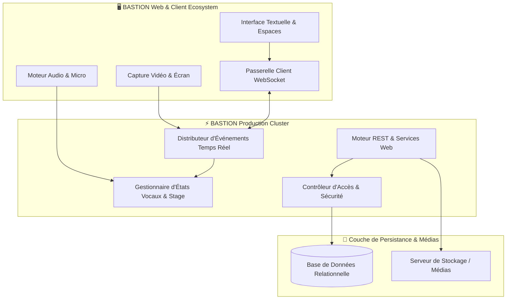

<div align="center">

  
  <br/>
  

  <p align="center">
    <a href="https://github.com/Bastion-Officiel"></a>
    <a href="#"></a>
    <a href="#"></a>
    <a href="#"></a>
    <a href="#"></a>
  </p>

  <h3>🏰 Infrastructure souveraine, temps réel et ultra-performante pour les communautés modernes.</h3>

  <p align="center">
    <a href="#-à-propos-de-bastion">À propos</a> •
    <a href="#-écosystème--dépôts-bastion">Écosystème & Dépôts</a> •
    <a href="#-fonctionnalités-phares">Fonctionnalités</a> •
    <a href="#-architecture-système">Architecture</a> •
    <a href="#-sécurité--souveraineté">Sécurité & Souveraineté</a> •
    <a href="#-rejoindre-la-communauté">Rejoindre</a>
  </p>

</div>

---

## 🌟 À Propos de BASTION

**BASTION** est une plateforme technologique moderne de communication instantanée haute fidélité, résiliente et souveraine, développée et entièrement opérée par l'organisation **BASTION**.

Conçu pour offrir une expérience sans friction, **BASTION** est une infrastructure hébergée et gérée de bout en bout : **aucune installation ni maintenance n'est requise pour les utilisateurs**, qui bénéficient immédiatement d'un service haut de gamme :
- **Fluidité & Réactivité maximale** : Latence réseau ultra-faible optimisée pour le temps réel.
- **Expérience immersive d'exception** : Thème sombre natif, animations fluides, interface dynamique.
- **Confidentialité & Maîtrise totale** : Données protégées et gouvernance centralisée sur une infrastructure dédiée haute disponibilité.

```ascii
  ____          _____ _______ _____ ____  _   _ 
 |  _ \   /\   / ____|__   __|_   _/ __ \| \ | |
 | |_) | /  \ | (___    | |    | || |  | |  \| |
 |  _ < / /\ \ \___ \   | |    | || |  | | . ` |
 | |_) / ____ \____) |  | |   _| || |__| | |\  |
 |____/_/    \_\_____/   |_|  |_____\____/|_| \_|
       REAL-TIME COMMUNITY ENGINE & PLATFORM      
```

---

## 🚀 Écosystème & Dépôts BASTION

<div align="center">
  <table>
    <thead>
      <tr>
        <th width="28%">Dépôt / Module</th>
        <th width="47%">Description & Responsabilités</th>
        <th width="25%">Technologies & Statut</th>
      </tr>
    </thead>
    <tbody>
      <tr>
        <td><strong>🏰 <a href="./DiscordApp">bastion-core</a></strong></td>
        <td>Cœur applicatif de BASTION : Moteur serveur asynchrone, passerelle WebSocket temps réel, gestionnaire d'état, couche de persistance et interface client unifiée.</td>
        <td> <br/><code>Python 3.10+</code> <code>MySQL</code> <code>WebSocket</code></td>
      </tr>
      <tr>
        <td><strong>🎙️ <a href="#">bastion-voice-engine</a></strong></td>
        <td>Moteur de traitement vocal haute fidélité et WebRTC : Analyse fréquentielle, détection active de prise de parole et passerelle de conférence Stage.</td>
        <td> <br/><code>WebRTC</code> <code>Web Audio API</code></td>
      </tr>
      <tr>
        <td><strong>🖥️ <a href="#">bastion-screenshare</a></strong></td>
        <td>Pipeline de streaming et capture vidéo multi-sources jusqu'à 60 FPS avec adaptation dynamique de flux.</td>
        <td> <br/><code>MediaStream</code> <code>Canvas</code></td>
      </tr>
      <tr>
        <td><strong>🛡️ <a href="#">bastion-badges-sdk</a></strong></td>
        <td>Système de distinctions et badges vectoriels vérifiés (Fondateur, Partenaire, Officiel, Bot Certifié, Supporter).</td>
        <td> <br/><code>SVG Engine</code> <code>Verification API</code></td>
      </tr>
      <tr>
        <td><strong>🤖 <a href="#">bastion-bot-framework</a></strong></td>
        <td>SDK officiel pour concevoir des bots, services automatisés et intégrations d'infrastructure sur BASTION.</td>
        <td> <br/><code>REST API</code> <code>Gateway WS</code></td>
      </tr>
    </tbody>
  </table>
</div>

---

## 💎 Fonctionnalités Phares

### 🎙️ Salons de Conférence (*Stage Channels*)
- **Salle d'attente interactive (*Waiting Screen*)** :
  - Interface dédiée avec flux d'actions : *Démarrer la conférence*, *Planifier un événement*, *Rejoindre en auditeur*.
  - Compteur et actualisation temps réel des membres en attente.
- **Scène de Conférence HD** :
  - **Cartes des Intervenants (*Speakers*)** : Bannières personnalisées, mise en avant visuelle du locuteur actif (`#23a55a`), indicateurs de modération et identifiants stylisés.
  - **Gestion dynamique de l'Audience** : Demandes d'accès à la scène par **levée de main ✋**, validation instantanée par les modérateurs et passage fluide au statut d'intervenant.
  - **Contrôle d'animation** : Gestion des droits de parole, modération de scène et clôture de session.

### 🔊 Salons Vocaux & Traitement Audio Temps Réel
- **Analyse acoustique instantanée** : Détection intelligente de la voix avec rétroaction visuelle immédiate.
- Halo lumineux actif automatique sur le profil et dans la liste des salons.
- Panneau de statut persistant de connexion vocale avec bascule rapide et contrôles audio.
- **Module Soundboard BASTION** : Bibliothèque d'effets sonores synthétisés et diffusés en temps réel.

### 🖥️ Diffusion d'Écran en Direct (*Live Screen Sharing*)
- Capture flexible (écran complet, fenêtre logicielle ou onglet) avec haute fluidité.
- Lecteur vidéo intégré avec statut **`🔴 EN DIRECT`**, affichage du diffuseur et immersion plein écran.

### 📁 Gestionnaire Multimédia & Échanges de Données
- Partage de médias haute résolution : images, clips vidéo et documents structurés.
- Optimisation des flux de transfert et distribution sécurisée des contenus.

---

## 🛠️ Architecture Système



---

## 🧰 Stack Technologique

<div align="center">
  
</div>

- **Core Server** : Python 3.10+, Architecture Asynchrone Haute Performance, Passerelle WebSocket temps réel.
- **Interface Client** : Architecture Web moderne, CSS optimisé pour le rendu graphique, JavaScript modulaire haute performance.
- **Multimédia & Flux** : WebRTC, Web Audio API, Canvas Engine.
- **Persistance** : MySQL / MariaDB haute disponibilité.

---

## 🔒 Sécurité & Souveraineté

BASTION intègre une politique de sécurité rigoureuse pour garantir l'intégrité de la plateforme :

- 🛡️ **Protection & Chiffrement** : Sécurisation intégrale des sessions et des flux de données en transit.
- 🔑 **Gestion des Autorisations (RBAC)** : Modèle de permissions strict et cloisonné avec validation systématique côté serveur.
- 🛡️ **Intégrité de l'Infrastructure** : Isolation des traitements, contrôle d'accès rigoureux et protection contre les attaques conventionnelles.
- 🌐 **Souveraineté des Données** : Plateforme opérée et hébergée directement par l'équipe BASTION sur une infrastructure souveraine dédiée.

---

## 👥 Rejoindre la Communauté

L'organisation **BASTION** est ouverte aux créateurs de contenu, partenaires et développeurs de bots :

- 💡 **Proposer une idée ou un partenariat** : Contactez l'équipe officielle BASTION.
- 🤖 **Développer des intégrations** : Utilisez le `bastion-bot-framework` pour enrichir les serveurs de votre communauté.
- 🐛 **Signaler un incident** : Ouvrez un signalement auprès de notre équipe support.

<div align="center">
  <br/>
  <sub>Conçu, développé et hébergé par l'organisation <strong>BASTION</strong> • © 2026 Tous droits réservés</sub>
  <br/><br/>
  
</div>

